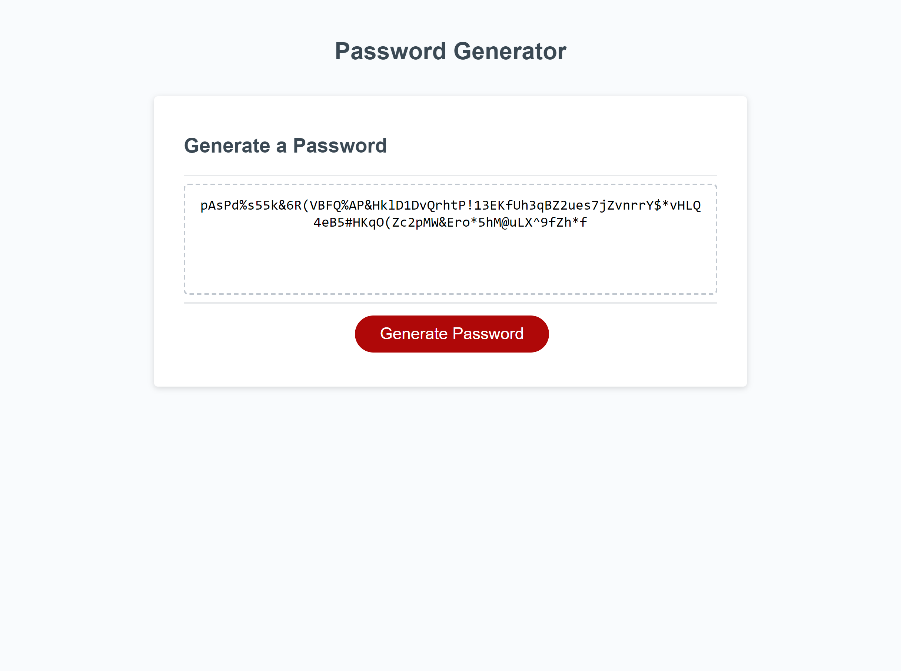

# zaingova-passwordGen

## Description

A JavaScript password generator tool. Prompts user for whether to use upper/lower case, numbers, special characters, and the password length, then generates a unique password derived from the information it has.

## Usage

Follow the prompts on the screen to define the password parameters and its length.

## Visuals

The following image shows the web application's appearance and functionality:

Here's a link to the Github repository:

[zaingova-passwordGenerator repository](https://github.com/zaingova/zaingova-passwordGen)

## Licence

Standard MIT licece